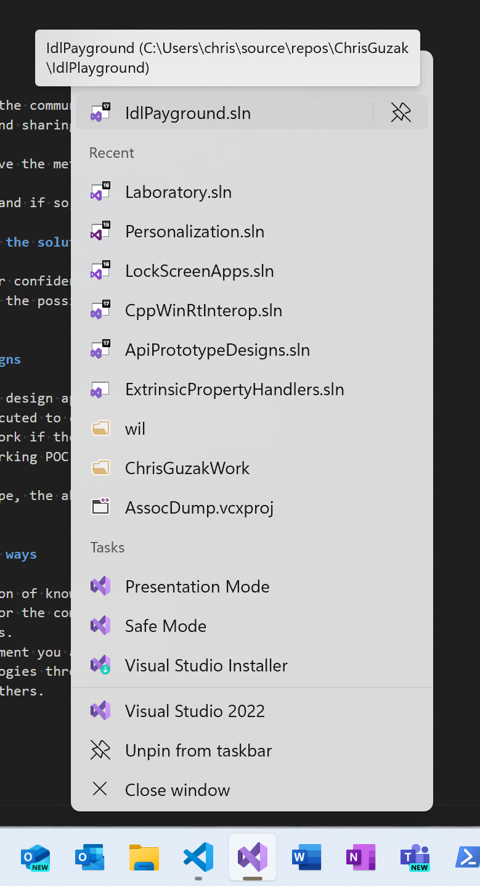

# IdlPlayground

A C++ project for creating WinRT based designs.

## Primary Goal - Demonstrate WinRT concepts in C++

* This uses a C++ VS Test project to provide **code examples**.
* It enables creation and implementation of **WinRT Interface Definition Language** (MIDL) **types**.
* Show **code examples**, the currency of API design.
* Enable **executing** the implementation and 

### Example

```cpp
#include "pch.h"
#include "CppUnitTest.h"
TEST_CLASS(DemonstrateSystemLauncher)
{
    TEST_METHOD(LaunchExample)
    {
        // ... sample code
    }
};
```

## Secondary Goal - Demonstrate Work in Isolation

Independent from the primary goal, this sample demonstrate the
**Work In Isolation** technique. This is applicable to any language or 
environment, this case shows C++/WinRT/Visual Studio IDE/github as the example.

### Getting Started

#### Pick a Host (like github)

Not all projects can use github. But given its scope, it is a great way
to share links to examples and invites participation.

Making setup easy is important or ensuring the ability to access it remotely
from the context where it is needed.

#### Create a project and get it building

Visual Studio offers templates for projects, this this is often a best first step.

After creating the project consider cleaning it up as the default templates can be simplified.
Fewer files, folders and a structure that makes working int the code simple.

Pick descriptive names and a README.md to introduce the project.

**Push to remote!** 

### Using the Project

In the environment where you need to be able to help others on coding issues, keep the project nearby.
Keeping it loaded in the IDE makes access fastest.

Questions can be answered with **"this compiles"** in seconds to to a few minutes.
**"this runs"** is also possible with a little more time investment.

Make the project easy to launch, pin it to the Visual Studio Taskbar JumpList.

{scale=50}

Be aware of the costs of multi-tasking.

#### Answer Questions

Try to directly demonstrate a solution to a problem someone is having or to demonstrate an
alternative solution.

##### Share a link

Copy and paste the snippet into the communication medium if that is sufficient. But
commonly pushing to the remote and sharing a link to github is needed.

Use this as an opportunity to give the method a good descriptive name.

See if the solution generalizes and if so, describe it in those terms.

##### Qualify your confidence in the solution

To set expectations, qualify your confidence in the solutions ability to
solve the problem. Be humble and the possibility that you don't fully understand the question.

### Create Proof of Concept Designs

When you advocate for a specific design approach creating the solution in
the form of code that can be executed to communicate it is very effective.
It can also reduce the cost of work if the team realizes that the problem
can be resolved simply with a working POC to start from.

If the problem is API design shape, the abstractions are the output of the design
.idl files that compile.

### Combine Knowledge in unique ways

* Leverage your unique combination of knowledge and target the most commonly
encountered issues of your team or the community that you operate in.
* Build up a library of solutions.
* Learn about the coding environment you are helping on deepest degree.
* Become fluent through practice.
* Contribute to the success of others.

